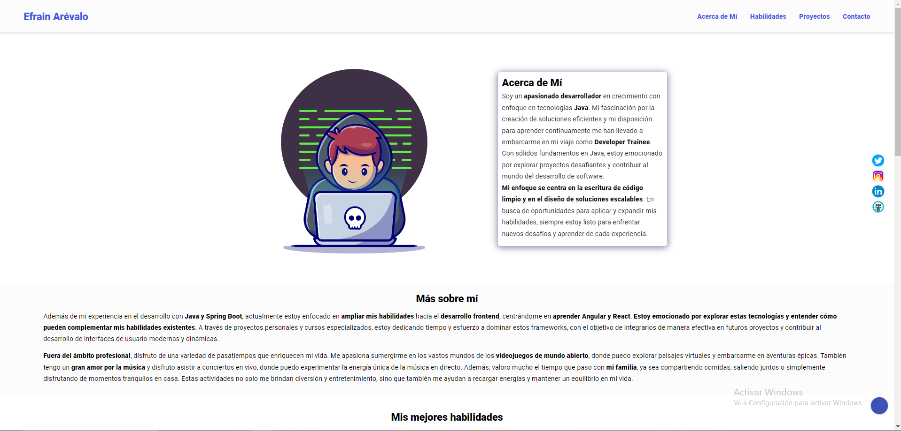

# DEVELOPER PORTFOLIO

Mi portafolio WEB!!!

## Autor

[@Efrasss](https://github.com/efrasss?tab=repositories)

## Github repo

Este es el [link](https://github.com/Efraska/portafolioWeb.git) al repositorio de Github del proyecto

## Sitio web de muestra

Ya hay una demostración en vivo disponible a través de este [link](https://portafoliowebefrain.netlify.app/)

## Pila de Tecnología

**Client:** HTML, CSS, Vanilla JavaSCript

## Herramientas utilizadas

A continuación se muestra una lista de las herramientas utilizadas y para qué se utilizaron exactamente:

- [Ion Icons](https://ionic.io/ionicons) para barra de menú de hamburguesas
- [Drawkit](https://www.drawkit.io/) para la ilustración de Efrain Arévalo
- [Icon8](https://icons8.com/) para íconos animados e íconos de habilidades
- [Animate CSS](https://animate.style/) para la animación del texto biográfico de Efrain Arévalo
- [Formspree](https://formspree.io/) para envío de formularios de contacto y envío directo a Gmail

## Estructura de carpetas

Los archivos index.html y Léame se encuentran en la carpeta raíz, junto con la captura de pantalla incluida en el Léame.

La carpeta de activos contiene los archivos CSS y JavaScript, todas las imágenes e íconos utilizados, en sus respectivas carpetas.

## Guía de personalización

Las distintas secciones de HTML y CSS están bien comentadas, así que siéntete libre de cambiar lo que no se adapte a tus necesidades.

Las funciones de JavaScript también están comentadas, para que sepa qué hacen las funciones y selecciones.

Usé Ion Icons e Icons8 para los íconos, pero siéntete libre de usar fontawesome o cualquier otra biblioteca de íconos que desees.

Para el envío del formulario, se utilizó Formspree. Puede obtener un tutorial práctico sobre cómo usar Formspree viendo esto [YouTube video](https://formspree.io/). Los envíos se enviarán directamente a la cuenta de Gmail especificada.

Además de Formspree, también puede utilizar el envío de formularios de Netlify en caso de que implemente allí. Brad Traversy tiene un [video tutorial](https://www.youtube.com/watch?v=6ElQ689HRcY) on how to do it.

## Agradecimientos

- [Awesome Readme Templates](https://awesomeopensource.com/project/elangosundar/awesome-README-templates)
- [Awesome README](https://github.com/matiassingers/awesome-readme)
- [How to write a Good readme](https://bulldogjob.com/news/449-how-to-write-a-good-readme-for-your-github-project)
